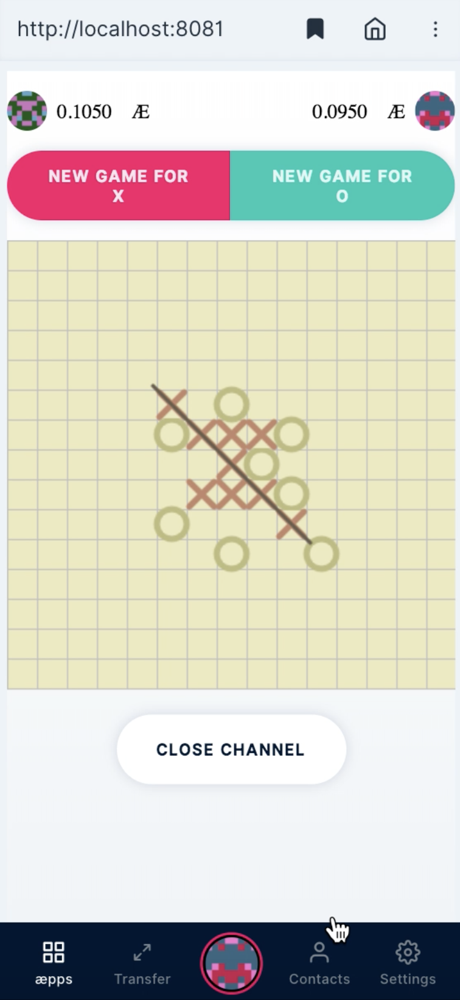

# Gomuku Game Guide
-----
## Welcome

Welcome to the official Gomuku Game Guide! Here you’ll find the basics on how to set up everything to get the game started.

### Getting Started
There are some things to consider and set up before being able to play Gomuku. Here are the three main requirements, so you can get started right away:

- Node.JS (v8.0.0)
- Epoch
- Accounts
- ættos

## Requirements

### Epoch

Before starting to set up the game you need to run an Epoch node on port ```3001``` locally. You can use the localnet, which is provided in the [epoch](https://github.com/aeternity/epoch) repository.

````
git clone https://github.com/aeternity/epoch.git
cd epoch
IMAGE_TAG=v0.25.0 docker-compose up -d
````
Please note that this project **doesn't work with epoch v1.0.0** (you can use v0.25.0) currently.

In case you want to see a **video tutorial**, how to run an æternity Node on macOS Mojave, please feel free to watch it [here](https://youtu.be/J3Ai97eS6Bo).

### Accounts

The minimum requirement for being able to play the Gomuku game are two. One account will be for the client and one for the server. In case you still haven't got any æternity account, go to [TUTORIAL: How to Create an æternity Account With CLI?](https://dev.aepps.com/tutorials/account-creation-in-ae-cli.html)

After setting up both accounts you need to replace the public key and private key in src/client/index.js with keys belonging to one of the accounts (client or server).


### ættos

Make sure that you've at least 100 ættos on each account. For more information how to get some ættos for testing purposes like playing the Gomuku game, go to [this](https://forum.aeternity.com/t/get-some-aettos-for-testing-purposes/1754/21) forum post. 


## Installation and Running

In order to make this Gomuku Game running, you need to install and run yarn, a package manager for JavaScript.

1. Install yarn
 
```
yarn install
```

2. Build yarn

```
yarn run build
```

3. Run game

```
SECRET_KEY PUBLIC_KEY yarn run start:dev
```

### Expected Output

If there aren't any errors displayed, go to http://localhost:8080 to play the game: 



You can **check logs** in chrome dev tools with ```CMD+OPTION+J```.

### Unexpected Error Output

In case you see this error outpot below, simply run ```yarn run start:dev``` again.

```
/Users/testuser/Desktop/dev/aepp-gomoku/src/gomoku/AppModel.js:3
import { getRandomInt } from './lib'
^^^^^^

SyntaxError: Unexpected token import
    at createScript (vm.js:80:10)
    at Object.runInThisContext (vm.js:139:10)
    at Module._compile (module.js:617:28)
    at Object.Module._extensions..js (module.js:664:10)
    at Module.load (module.js:566:32)
    at tryModuleLoad (module.js:506:12)
    at Function.Module._load (module.js:498:3)
    at Module.require (module.js:597:17)
    at require (internal/module.js:11:18)
    at Object.<anonymous> (/Users/michalpowaga/Desktop/dev/aepp-gomoku/index.js:1:77)
[nodemon] app crashed - waiting for file changes before starting...
```
